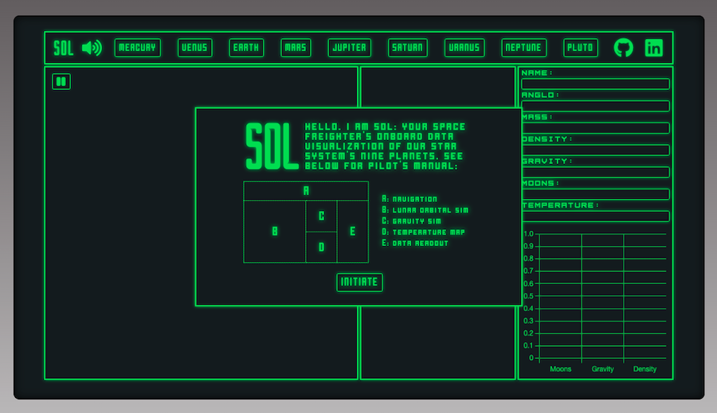
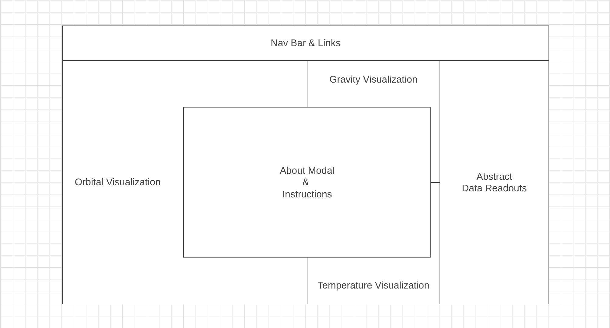
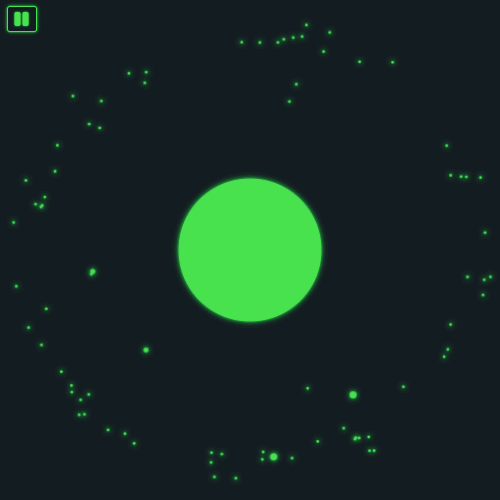
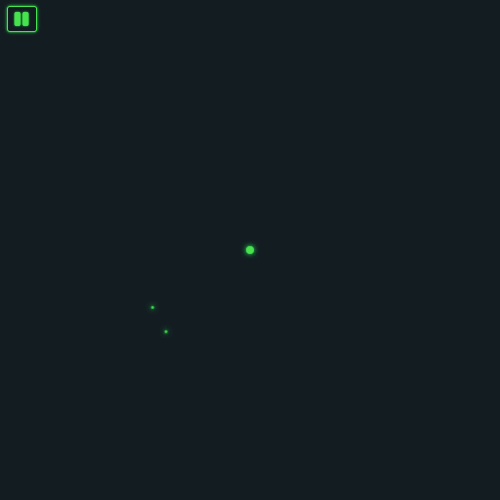
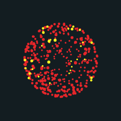
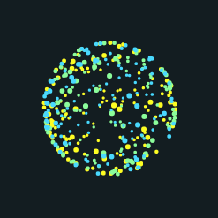
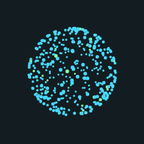
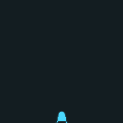

# Sol

[Sol](https://keginzburg.github.io/sol/) is a 2D data visualization of our solar system's nine planets and their respective characteristics. This includes everything from physical characteristics (size, temperature, gravity) to orbital parameters (lunar bodies). First, Sol presents the user with the nine main planets. After choosing a specific planetary body, it fetches that body's unique data. That unique data is then dynamically rendered to highlight each planetary body's uniqueness. Sol presents all data in a futuristic, yet retro aesthetic, taking inspiration from the 1979 film *Alien* and its setting, the spaceship Nostromo. It aims to replicate an 8-bit desktop interface with outdated vector graphics.



## Wireframe:



* About Modal and Nav Bar display "SOL" in HTML headings with links to this project's Github repo and my LinkedIn.
* Nav Bar includes clickable planet links that change the visualizations and fetch respective data.
* Orbital, Gravity, and Temperature Visualizations provide dynamic canvas renders of the fetched data.
* Abstract Data Readouts provides D3 and HTML renders of non-visual data.

## Functionality & MVPs:

### In Sol, users are able to:

* Choose between the nine, main planets of our solar system via the planet links in the nav bar. Upon doing so, Sol fetches said planet's data from an API and feeds that data into three distinct simulations: Orbit, Gravity, and Temperature.

### Orbit:
<p float="left">




</p>

* Observe the orbital bodies of each respective planet and how they differ. Users can pause and resume orbit simulations and hover over lunar bodies to identify their unique names. Orbital bodies were built with planet and moon classes. Upon fetching data for a specific planet (and subsequently its respective moons), that data was parsed and fed into respective planet and moon instances. Then, these instances were drawn and updated on the orbit canvas with the following pieces of data (semimajorAxis, eccentricity, sideralOrbit, name, and radius).

```js
  let planet;
  planet = new Planet(orbitCanvas.width / 2, orbitCanvas.height / 2, planetData.meanRadius * 0.001);

  function captureMoons(moonData, moonArr) {
    moonArr.length = 0;

    if (moonData != null)
      for (let i = 0; i < moonData.length; i++) {
        let moonURL = moonData[i].rel;
        fetch(moonURL)
          .then(response => {
            return response.json();
          })
          .then(planetData => {
            let moonDistanceX = optimizeAxis(planetData.semimajorAxis);
            let moonDistanceY = semiMinorAxis(moonDistanceX, planetData.eccentricity);
            let moonSpeed = optimizeSpeed(planetData.sideralOrbit);
            let moonName = planetData.id;

            if (planetData.meanRadius > planetData.equaRadius) {
              let moonRadius = planetData.meanRadius;
              moonArr.push(new Moon(orbitCanvas.width / 2, orbitCanvas.height / 2, Math.ceil(moonRadius * 0.001), Math.random() * Math.PI * 2, moonDistanceX, moonDistanceY, moonSpeed, moonName));
            } else {
              let moonRadius = planetData.equaRadius;
              moonArr.push(new Moon(orbitCanvas.width / 2, orbitCanvas.height / 2, Math.ceil(moonRadius * 0.001), Math.random() * Math.PI * 2, moonDistanceX, moonDistanceY, moonSpeed, moonName));
            }
          })
      }
  }
```

* These canvas drawings were then animated using an animate method that recursively called itself. Initially, canvas animations were not visually accesible because the fetched data was not scaled for a 500px by 500px 2D canvas. For instance, for the larger planetary bodies, some moons are 8 figures of kilometers away, while others are 6 figures, and the planetary body itself is only 5 figures. In order to solve this, I ended up writing specific functions to translate that data to an appropriate scale.

```js
  function optimizeAxis(semimajorAxis) {
    if (semimajorAxis < 100000) {
      return Math.random() * 35 + 100;
    } else if (semimajorAxis < 1000000 && semimajorAxis > 100000) {
      return Math.random() * 35 + 135;
    } else if (semimajorAxis < 10000000 && semimajorAxis > 1000000) {
      return Math.random() * 35 + 170;
    } else {
      return Math.random() * 35 + 205;
    }
  }

  function semiMinorAxis(major, eccen) {
    return major * (Math.sqrt(1 - (eccen * eccen)));
  }

  function optimizeSpeed(sideralOrbit) {
    if (sideralOrbit < 1) {
      return Math.random() * 0.001 + 0.01;
    } else if (sideralOrbit > 1 && sideralOrbit < 10) {
      return Math.random() * 0.001 + 0.0025;
    } else if (sideralOrbit > 10 && sideralOrbit < 100) {
      return Math.random() * 0.001 + 0.000625;
    } else if (sideralOrbit > 100 && sideralOrbit < 1000) {
      return Math.random() * 0.001 + 0.00015625;
    } else {
      return Math.random() * 0.001 + 0.00003906;
    }
  }
```

* Additionally, it is possible to pause and resume the orbital simulations and read each lunar body's unique name when hovering over their position with your cursor. This involved DOM manipulation and matching the window mouseover position with that of the individual moon instance's stored position values.

```js
  let pause = true;
  const moonInfo = document.querySelector(".moon_info");
  const pauseButton = document.querySelector(".orbit_pause");
  pauseButton.addEventListener('click', function () {
    if (pause) {
      pauseButton.id = 'on';
      pause = false;
      pauseButton.innerHTML = '<i class="fas fa-play"></i>';
      moonInfo.style.display = "inline-block";
    } else {
      pauseButton.id = 'off';
      pause = true;
      pauseButton.innerHTML = '<i class="fas fa-pause"></i>'
      moonInfo.style.display = "none";
    }
  })

  function getMousePos(canvas, e) {
    const square = canvas.getBoundingClientRect();
    return {
      x: e.clientX - square.left,
      y: e.clientY - square.top
    };
  }

  const orbitCanvas = document.querySelector(".orbit_canvas");
  orbitCanvas.addEventListener('mousemove', (e) => {
    let mouse = getMousePos(orbitCanvas, e);
    moons.forEach(moon => {
      let moonX = Math.floor(moon.x);
      let moonY = Math.floor(moon.y);
      if ((mouse.x-6 < moonX+10 && mouse.x-6 > moonX-10) && (mouse.y-4 < moonY+5 && mouse.y-4 > moonY-5)) {
        if(moon.name === "") {
          moonInfo.innerText = "moon id: unknown";
        } else {
          moonInfo.innerText = `moon id: ${moon.name.toLowerCase()}`;
        }
      }
    })
    
  })
```

### Temperature:
<p float="left">





</p>

* Observe a temperature visualization for each respective planet. Entropy body were built with entropy and particle classes. Upon fetching data for a specific planet, that planet's avgTemp was parsed and utilized. Initially, I thought to depict the temperature differences as colored particles that would bounce around the confines of their canvas. After some canvas research though, a "3D" rendering of each planet's heat map became possible. A mathematical function was utilized in order to establish a frame of reference and dynamic x and z position changes along with particle size changes. As the particles "rotate", their x position cycles between two x boundaries, dependent on their y position, and grow bigger and smaller dependent on their z position. This gave the illusion of 3D on the 2D canvas.

```js
  project(sin, cos) {
    const rotX = cos * this.x + sin * (this.z - this.planetCenterZ);
    const rotZ = -sin * this.x + cos * (this.z - this.planetCenterZ);
    this.sizePov = this.fov / (this.fov - rotZ);
    this.xPov = (rotX * this.sizePov) + this.povCenterX;
    this.yPov = (this.y * this.sizePov) + this.povCenterY;
  }

    createParticles() {
    this.particles.length = 0;

    for (let i=0; i<this.particlesAmount; i++) {
      const theta = Math.random() * 2 * Math.PI;
      const phi = Math.acos((Math.random() * 2) - 1);

      const x = this.planetRadius * Math.sin(phi) * Math.cos(theta);
      const y = this.planetRadius * Math.sin(phi) * Math.sin(theta);
      const z = (this.planetRadius * Math.cos(phi)) + this.planetCenterZ;

      this.particles.push(new Particles(x, y, z, this.ctx3, this.particleRadius, this.povCenterX, this.povCenterY, this.planetCenterZ, this.fov, this.tempColor(i)));
    }
  }
```

* To incorporate color into the heat map, a temperature ceiling constant was established and depending on where each planet's avgTemp fell as a percentage of that constant, a unique ratio of particles were assigned colors (crimson, yellow, green, blue).

```js
  tempColor(i) {
    let highPercentage = Math.floor((this.temperature / 800) * 400)
    if (highPercentage < 100) {
      if (i < highPercentage) {
        return "rgba(140, 254, 156, 255)";
      } else {
        return "rgba(74, 217, 254, 255)";
      }
    } else if (highPercentage < 200) {
      if (i < highPercentage) {
        return "rgba(254, 254, 34, 255)";
      } else if (i < highPercentage+(400-highPercentage)/2) {
        return "rgba(140, 254, 156, 255)";
      } else {
        return "rgba(74, 217, 254, 255)";
      }
    } else if (highPercentage < 300) {
      if (i < highPercentage) {
        return "rgba(231, 38, 43, 255)";
      } else if (i < highPercentage + (400 - highPercentage) / 2) {
        return "rgba(254, 254, 34, 255)";
      } else {
        return "rgba(140, 254, 156, 255)";
      }
    } else {
      if (i < highPercentage) {
        return "rgba(231, 38, 43, 255)";
      } else {
        return "rgba(254, 254, 34, 255)";
      }
    }
  }
```

### Gravity:
<p float="left">




</p>

* Initiate a gravity simulation for each respective planet. Upon fetching data for a specific planet, that planet's gravity was parsed and utilized by a fallingObject class. This was then used to draw the position of two landers and accelerate one's "freefall" in the 2D canvas. One of the lander's, known as the ghost, kept a constant gravity value of 9.8 (earth's gravity). This constant displays a frame of reference between earth's gravity and other planet's different gravity values.

```js
  this.updateObject = (ctx) => {
    this.gravitySpeed += this.gravity;
    if (this.y < 233) {
      this.y = this.y + this.gravitySpeed;
    }
    if (this.y > 233) {
      this.y = 233;
    }
    this.drawObject(ctx);
  }

  this.updateGhost = (ctx, obj) => {
    this.gravitySpeed += this.gravity;
    if (this.ghostY < 233) {
      this.ghostY = this.ghostY + this.gravitySpeed;
      this.drawGhost(ctx);
    }
    if (this.ghostY > 233) {
      this.ghostY = 233;
    }
    if (obj.y !== 233 && this.y !== 233) {
      this.drawGhost(ctx);
    }
  }
```

### In addition, this project includes:

* An About modal describing the background and structure of the data visualization.
* This production README.

## Technologies, Libraries, APIs:

* This project is be implemented with the following technologies:
* The Solar System OpenData API: https://api.le-systeme-solaire.net/en/.
* The Canvas API to render the planetary/lunar bodies, gravity, and temperature.
* The D3 API to render any non-visual data.
* Webpack to bundle and transpile the source JavaScript code.
* npm to manage project dependencies.


## Implementation Timeline:

* Friday Afternoon & Weekend: Setup project, including getting webpack up and running. Create Planet, Moon, OrbitSim classes and ensure that my data is being fetched properly. Get planet and moon canvas visualizations to show up on the screen and build basic structure for lunar orbits. Write formula functions that adapt orbital data for canvas design. Also begin setting up gravity and temperature canvases and respective classes.

* Monday: Dedicate this day toward implementing the underlying logic of Sol. Apply basic animation and ensure that my Orbit canvas dynamically renders accurate, yet accessible representations of the individual planets and their lunar bodies. Continue to ensure that my data is being fetched properly before creating planet links that fetch orbital, gravity, and temperature data from API. 

* Tuesday: Focus on the gravity and temperature canvases. Create a basic environment for my gravity canvas and  GravitySim and FallingObject classes. Create a visually striking and informative temperature readout out of a canvas rendering and TempSim and Entropy classes.

* Wednesday: Finish implementing data visualization interactivity, and focus on styling, as well as implementing the color scheme and styled nav links. If time, start on bonuses.

* Thursday Morning: Deploy to GitHub pages.


## Future Implementations:

* Add more detail to lunar lander in gravity simulation.
* Add dynamic backgrounds for Orbit canvas.
* Add interactive spaceship avatar that can "fly" through Orbit canvas.
* Add solar system modal.
* Add "Houston, we have a problem!" error functionality.


## CC Licensing:

* Favicon [solar system](https://thenounproject.com/icon/solar-system-1245933/) by [Ralf Schmitzer](https://thenounproject.com/ralfschmitzer/).
* [Volume](https://fontawesome.com/v5.15/icons/volume-up?style=solid) icons were provided by [Font Awesome](https://fontawesome.com/license) and only had colors changes.
* Background wallpaper design from Stanley Kubrick's *The Shining*.
* Music track *Hypersleep* from Jerry Goldsmith's 
Original Motion Picture Soundtrack for *Alien*.