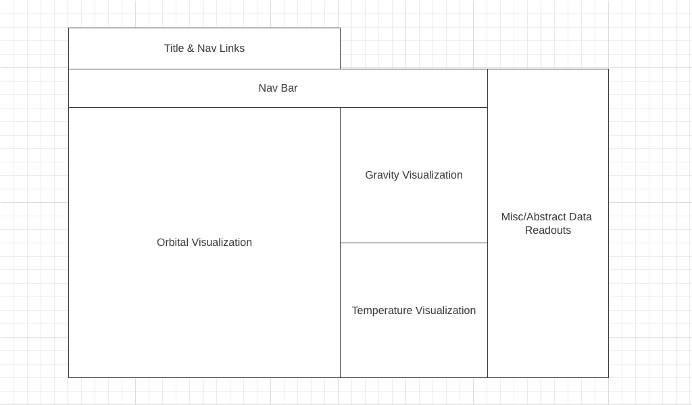

# JS Project Proposal: Sol

## Background:

Sol is a 2D data visualization of our solar system's nine planets and their respective characteristics. This includes everything from physical characteristics (size, temperature, gravity) to orbital parameters (lunar bodies). First, Sol presents the user with the nine main planets. After choosing a specific planetary body, it fetches that body's unique data. That unique data is then dynamically rendered to highlight each planetary body's uniqueness. Sol presents all data in a futuristic, yet retro aesthetic, taking inspiration from the 1979 film Alien and its setting, the spaceship Nostromo. It aims to replicate an 8-bit desktop interface with outdated vector graphics.

## Functionality & MVPs:

### In Sol, users will be able to:

* Choose between the nine, main planets of our solar system.
* Observe the orbital bodies of each respective planet and how they differ.
* Observe a temperature visualization for each respective planet.
* Initiate a gravity simulation for each respective planet.

### In addition, this project will include:

* An About modal describing the background and structure of the data visualization.
* A production README.

## Wireframe:

* Title will display "SOL" in an HTML heading with links to this project's Github repo and my LinkedIn.
* Nav Bar will include clickable planet links that change the visualizations and data.
* Orbital, Gravity, and Temperature Visualizations will provide canvas renders of the respective data.
* Abstract Data Readouts will provide D3 renders of less tangible data.

## Technologies, Libraries, APIs:

* This project will be implemented with the following technologies:
* The Solar System OpenData API: https://api.le-systeme-solaire.net/en/.
* The Canvas API to render the planetary/lunar bodies, gravity, and temperature.
* The D3 API to render any non-visual data.
* Webpack to bundle and transpile the source JavaScript code.
* npm to manage project dependencies.

## Implementation Timeline:

* Friday Afternoon & Weekend: Setup project, including getting webpack up and running. Create Planet, Moon, Simulation classes and ensure that my data is being fetched properly. Get planet and moon canvas visualizations to show up on the screen and build basic structure for lunar orbits. Write formula functions that adapt orbital data for canvas design. Also begin setting up gravity and temperature canvases and respective classes.

* Monday: Dedicate this day toward implementing the underlying logic of Sol. Apply basic animation and ensure that I can get my Orbit canvas to dynamically render accurate, yet accessible representations of the individual planets and their lunar bodies. Ensure that my data is being fetched properly before creating planet links that fetch orbital, gravity, and temperature data from API. 

* Tuesday: Focus on the gravity and temperature canvases. Create a basic environment for my gravity canvas and a FallingObject class for gravity simulation. Create a visually striking and informative temperature readout out of a canvas rendering and Temperature class.

* Wednesday: Finish implementing data visualization interactivity, and focus on styling, as well as implementing the color scheme and styled nav links. If time, start on bonuses.

* Thursday Morning: Deploy to GitHub pages. If time, rewrite this proposal as a production README.

## Bonus Features:

* ~~Emulate Alien 1979 aesthetic.~~
* ~~Add music and sounds for atmosphere.~~
* ~~Add D3 graph visualizations for abstract data.~~
* ~~Add 1G gravity lander for reference in gravity simulation.~~
* ~~Add retro computer monitor background around main content.~~
* Add more detail to lunar lander in gravity simulation.
* Add dynamic backgrounds for canvas.
* Add improved data identifiers for planets and respective bodies.
* Add ability to pause and resume simulations.
* Add interactive spaceship avatar that can "fly" through orbit simulation.
* Add solar system modal.

## CC Licensing:

* Favicon [solar system](https://thenounproject.com/icon/solar-system-1245933/) by [Ralf Schmitzer](https://thenounproject.com/ralfschmitzer/).
* [Volume](https://fontawesome.com/v5.15/icons/volume-up?style=solid) icons were provided by [Font Awesome](https://fontawesome.com/license) and only had colors changes.
* Background wallpaper design from Stanley Kubrick's *The Shining*.
